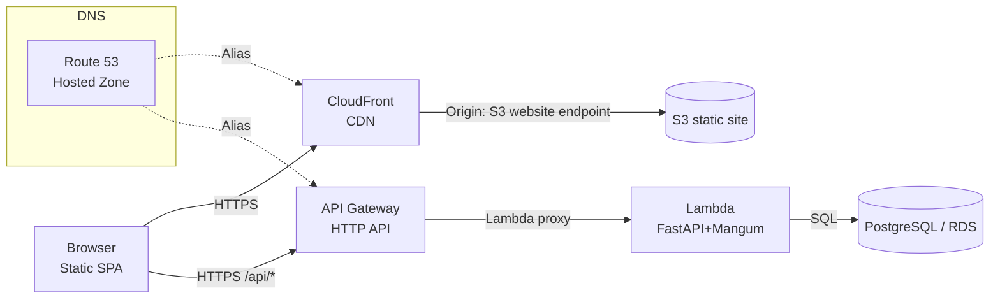

# Me-API Playground MVP

## Overview
A minimal portfolio/API stack deployed on AWS, with a static frontend and a serverless backend. Key learnings:
- S3 static website **must use the website endpoint**, not the REST endpoint; custom domains require bucket name == domain.
- HTTPS for S3 website requires **CloudFront** (or another CDN/SSL terminator); Route 53 maps the domain via aliases.
- API is packaged as a Lambda + API Gateway HTTP API; zip must include app code at the root plus dependencies.
- Pydantic v2 was rolled back to v1 to keep FastAPI and Lambda compatible; schemas use v1 `Config.orm_mode`.
- Local environment friction (fish vs bash) and code-oss quirks added iteration cost; pinning dependencies and using consistent shells mitigated breakage.
- Keep endpoints private: replace any placeholder values with your own at deploy time and avoid committing real API IDs, domains, or bucket names.

## Architecture


### Notes
- CloudFront needed for HTTPS on the static site; S3 website endpoint stays HTTP-only.
- API Gateway handles CORS; Lambda adds middleware to ensure CORS on all responses.
- `DATABASE_URL` required in Lambda env; place Lambda in VPC with SG rules to reach RDS if private.

## Deployment Phases
1. **Prep & Pinning**
   - Freeze dependencies (`fastapi 0.95.x`, `pydantic 1.10.x`, `sqlalchemy 2.x`), confirm `requirements.txt` matches Lambda package.
   - Standardize shell (bash/zsh) to avoid venv activation issues on fish.
2. **Backend Package**
   - `pip install -r requirements.txt -t ./lamda_fn_pkg` and copy app code to the package root.
   - Zip contents (not the folder) and upload/deploy to Lambda. Handler: `main.handler`.
3. **API Gateway**
   - HTTP API, routes: ANY `/` and ANY `/{proxy+}` -> Lambda proxy integration.
   - CORS: Allow `GET,POST,PUT,DELETE,OPTIONS`, headers `*`, origin `*` (or your domain when set).
4. **Database**
   - RDS/Postgres (or pg-compatible). Set `DATABASE_URL` in Lambda env. Apply Alembic migrations/seed.
5. **Frontend**
   - Build static assets; upload to S3 bucket named exactly your domain; enable static website hosting.
   - Test via the **S3 website endpoint** first.
6. **CloudFront + DNS**
   - CloudFront distribution with origin = S3 website endpoint. Attach ACM cert (in us-east-1) for your domain.
   - Route 53 A/AAAA alias to CloudFront. (If exposing API on same domain, map `/api/*` to API Gateway via a second CF origin or a custom APIGW domain.)
7. **Validate**
   - Health: `/health` via API Gateway.
   - CORS: check `Access-Control-Allow-Origin` in responses.
   - Frontend served over HTTPS and calls API without CORS errors.

## Testing Matrix
- **Unit**: Pydantic schema validation (v1), simple model serialization.
- **Integration (local)**: `uvicorn` + SQLite/Postgres; hit `/health`, `/profile`, `/projects` with sample payloads.
- **Integration (Lambda URL/APIGW)**: `curl` API Gateway invoke URL with `?name=<profile>`; verify CORS headers.
- **E2E**: Load S3/CloudFront site, fetch dashboard, filters, and chart rendering.

## Operational Checklist
- `DATABASE_URL` set and reachable from Lambda (VPC/SG routes).
- Lambda timeout ≥ 5–10s; memory ≥ 256MB.
- CORS enabled on API Gateway; middleware in FastAPI ensures ACAO on errors.
- S3 bucket public (for website) or fronted by CloudFront OAC; index document set.
- Custom domain: bucket name == domain; ACM cert in us-east-1; Route 53 aliases to CloudFront and API Gateway/custom domain as needed.

## Quick Commands
- Local server for frontend: `python -m http.server 8000` (then open `http://localhost:8000/Frontend/index.html`).
- Health check: `curl "https://<api-id>.execute-api.<region>.amazonaws.com/health"`
- Profile fetch: `curl "https://<api-id>.execute-api.<region>.amazonaws.com/profile?name=string"`
- Package backend for Lambda (example):
  ```bash
  cd lamda_fn_pkg
  zip -r ../backend.zip .
  ```

## Future Improvements
- Add CI lint/test + IaC (CDK/Terraform) for repeatable deployments.
- Add auth (Cognito) and rate limiting at API Gateway.
- Swap mock skill weights for real computed metrics in charts.
